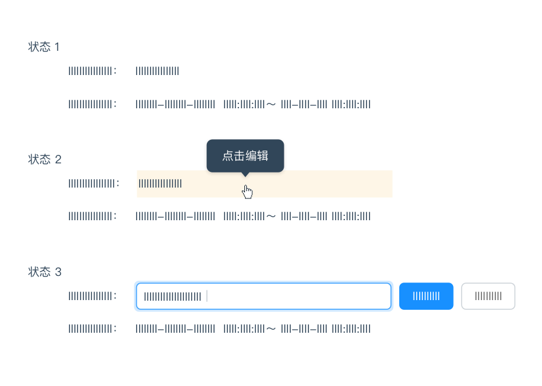

## 概述
### 介绍
我们希冀创造一种新的视觉设计语言，能够遵循优秀的设计定则，同时还具有创新理念和新科技。我们希望搭建一种独一无二的底层系统，在这个系统的基础上，能跨平台和超越设备尺寸的统一体验Vision涵盖设计基础、设计实践、方法思考、
组件资源等，借助中国军网产品设计的实际案例具体讲述了日常工作中不可避免的用户引导、色彩搭配、品牌设计、体验设计、信息层级、设计规范等内容。

### 设计价值观

经常有人问：什么是好的设计？提问的人往往是希望能从工作中提炼出几个简单的原则。但这样的问题并不是那么容易回答，越是深入了解，越能体会到设计的复杂性。
设计的好坏并没有一个绝对值，当设计往一边倾斜的时候，必然带来这个定位的优点和缺点。所以一个好的设计应该是权衡所有的利弊之后，选择的一个最优的平衡点。
往大了说，做某个产品的品牌设计，把它设计得非常有个性，但如果风格太过超前，可能就只有少数头部用户才能领略到设计的精髓，对于海量的长尾用户来说，这样的设计是脱节的，他们没办法理解，这时，产品就变得小众，很难被广泛接受。如果风格过于保守，没有亮点，产品就会石沉大海。
往小了说，一个界面、一个流程或者一个控件的设计，往往也都面临着众多选择，在某些条件下，效率、认知、记忆、情感等体验要素会存在互斥关系。比如电商产品的首页，商品图形越大，每屏商品的信息量就越低；而商品图形越小，商品的识别效果越差，这同样影响信息的有效传递。
所以一个好的设计，通常不是因为技术有多么强大，而是在大量设计决策中总是能把握最优的平衡点。能做出优秀决策的前提是你对市场、用户、产品了解的深度。正如原研哉的一句话：“设计不是一种技能，而是捕捉事物本质的感觉能力和洞察能力。”
Vision包含了众多项目的设计实践经验和设计思路、设计方法，无论你当前的设计水平如何，都能激发你生活中的设计灵感，尽情沉浸其中吧！

#### asasdasd

asdasdasdasdasdadasdasd

## 原则

### 亲密性

如果信息之间关联性越高，它们之间的距离就应该越接近，也越像一个视觉单元；反之，则它们的距离就应该越远，也越像多个视觉单元。亲密性的根本目的是实现组织性，让用户对页面结构和信息层次一目了然。

#### 纵向间距关系

 通过『小号间距』、『中号间距』、『大号间距』这三种规格来划分信息层次。

> 纵向间距示例 在 Ant Design 中，这三种规格分别为：8px（小号间距）、16px（中号间距）、24px（大号间距）

在这三种规格不适用的情况下，可以通过加减『基础间距』的倍数，或者增加元素来拉开信息层次。
注：在 Ant Design 中，y=8+8*n。其中，n>=0，y 是纵向间距，8 是『基础间距』。

> 增加元素示例通过增加『分割线』来拉开层次。

#### 横向间距关系

为了适用不同尺寸的屏幕，在横向采用栅格布局来排布组件，从而保证布局的灵活性。

> 组合排布示例

在一个组件内部，元素的横向间距也应该有所不同。

> 复选框内示例

### 对齐

正如『格式塔学派』中的连续律（Law of Continuity）所描述的，在知觉过程中人们往往倾向于使知觉对象的直线继续成为直线，使曲线继续成为曲线。在界面设计中，将元素进行对齐，既符合用户的认知特性，也能引导视觉流向，让用户更流畅地接收信息。

格式塔学派（德语：Gestalttheorie） ：是心理学重要流派之一，兴起于 20 世纪初的德国，又称为完形心理学；主张人脑的运作原理是整体的，『整体不同于其部件的总和』。——摘自『维基百科』

#### 文案类对齐

如果页面的字段或段落较短、较散时，需要确定一个统一的视觉起点。

 
> 推荐示例标题和正文左对齐，使用了一个视觉起点。

> 不推荐示例标题和正文使用了两个视觉起点，不推荐该种对齐方式，除非刻意强调两者区别。

#### 表单类对齐

冒号对齐（右对齐）能让内容锁定在一定范围内，让用户眼球顺着冒号的视觉流，就能找到所有填写项，从而提高填写效率。

> 冒号对齐示例

#### 数字类对齐对齐

为了快速对比数值大小，建议所有数值取相同有效位数，并且右对齐。

 
> 正确示例

> 错误示例

### 对比

对比是增加视觉效果最有效方法之一，同时也能在不同元素之间建立一种有组织的层次结构，让用户快速识别关键信息。
注：要实现有效的对比，对比就必须强烈，切不可畏畏缩缩。

#### 主次关系对比

为了让用户能在操作上（类似表单、弹出框等场景）快速做出判断， 来突出其中一项相对更重要或者更高频的操作。
注意：突出的方法，不局限于强化重点项，也可以是弱化其他项。

 
> 正确示例

> 错误示例

在一些需要用户慎重决策的场景中，系统应该保持中立，不能替用户或者诱导用户做出判断。

> 不区分主次的示例『通过』和『驳回』都使用次按钮，系统保持中立。

#### 总分关系对比

通过调整排版、字体、大小等方式来突出层次感，区分总分关系，使得页面更具张力和节奏感。

 
> 总分关系示例 1

> 总分关系示例 2

#### 状态关系对比

通过改变颜色、增加辅助形状等方法来实现状态关系的对比，以便用户更好的区分信息。
常见类型有『静态对比』、『动态对比』。

 
> 静态对比示例 用不同颜色点，来表明不同状态。

> 动态对比示例 鼠标悬停时，该项和其他项呈现出明显不同的视觉效果，响应用户操作。

### 重复

相同的元素在整个界面中不断重复，不仅可以有效降低用户的学习成本，也可以帮助用户识别出这些元素之间的关联性。

#### 重复元素

重复元素可以是一条粗线、一种线框，某种相同的颜色、设计要素、设计风格，某种格式、空间关系等。

 
> 线框重复示例

> 设计要素重复示例

> 文案格式重复示例

### 直截了当

正如 Alan Cooper 所言：『需要在哪里输出，就要允许在哪里输入』。这就是直接操作的原理。eg：不要为了编辑内容而打开另一个页面，应该直接在上下文中实现编辑。

#### 页内编辑

单字段行内编辑 当『易读性』远比『易编辑性』重要时，可以使用『单击编辑』。

 
>单击编辑示例  状态一：普通的浏览模式，不区分可编辑行和不可编辑行； 状态二：鼠标悬停时，『指针』变为『手型』，编辑区域底色变黄，出现『Tooltips』提示单击编辑； 状态三：鼠标点击后，出现『输入框』、『确定』、『取消』表单元素，同时光标定位在『输入框』中。

当『易读性』为主，同时又要突出操作行的『易编辑性』时，可使用『文字链/图标编辑』。

> 文字链/图标编辑示例 状态一：在可编辑行附近出现文字链/图标； 状态二：鼠标点击『编辑』后，出现『输入框』、『确定』、『取消』表单元素，同时光标定位在『输入框』中。

多字段行内编辑
注：在『多字段行内编辑』的情况下，显示的内容和编辑时所需的字段会存在比较大的差异，所以更需要『巧用过渡』原则中的『解释刚刚发生了什么』来消除这种视觉影响。

 
> 多字段行内编辑示例 编辑模式在不破坏整体性的前提下，可扩大空间，以便放下『输入框』等表单元素；其中，在 Table 中进行编辑模式切换时，需要保证每列的不跳动。

#### 利用拖放

拖放列表
只能限制在一个维度（上/下或者左/右）进行拖放。

> **拖放列表示例** 状态一：鼠标悬停该行时，出现可移动的『图标』； 状态二：鼠标悬停在该『图标』时，指针变为『手型』，点击即可进行拖动； 状态三：拖动到可放置区块，出现蓝色描边，告知用户该区块可放置该对象。

拖放图片/文件

> 拖放图片/文件示例

### 足不出户

能在这个页面解决的问题，就不要去其它页面解决，因为任何页面刷新和跳转都会引起变化盲视（Change Blindness），导致用户心流（Flow）被打断。频繁的页面刷新和跳转，就像在看戏时，演员说完一行台词就安排一次谢幕一样。

变化盲视（Change Blindness） ：指视觉场景中的某些变化并未被观察者注意到的心理现象。产生这种现象的原因包括场景中的障碍物，眼球运动、地点的变化，或者是缺乏注意力等。——摘自《维基百科》

心流（Flow） ：也有别名以化境 (Zone) 表示，亦有人翻译为神驰状态，定义是一种将个人精神力完全投注在某种活动上的感觉；心流产生时同时会有高度的兴奋及充实感。——摘自《维基百科》

#### 页内编辑

二次确认覆盖层：避免滥用 Modal 进行二次确认，应该勇敢的让用户去尝试，给用户机会『撤消』即可。

> **推荐示例** 用户点击『删除』后，直接操作；出现 Message 告知用户操作成功，并提供用户『撤消』的按钮；用户进行下一个操作或者 1 分钟内不进行任何操作， Message 消失，用户无法再『撤消』。

*推荐示例
特例：在执行某些无法『撤消』的操作时，可以点击『删除』后，出现 Popconfirm 进行二次确认，在当前页面完成任务。*

> **不推荐示例**   滥用 Modal 进行二次确认，就像『狼来了』一样，既打断用户心流（无法将上下文带到弹出框中），也无法避免失误的发生。

详情覆盖层：一般在列表中，通过用户『悬停』/『点击』某个区块，在当前页加载该条列表项的更多详情信息。

**注：使用『悬停』激活时，当鼠标移入时，需要设置 0.5 秒左右的延迟触发；当鼠标移出时，立刻关闭覆盖层**

> **详情覆盖层示例** 通过『点击』图标查看更多详情信息。 输入覆盖层：在覆盖层上，让用户直接进行少量字段的输入。

> **输入覆盖层示例** 
鼠标『点击』图标触发；鼠标『点击』悬浮层以外的其他区块后，直接保存输入结果并退出。*

#### 嵌入层

列表嵌入层：在列表中，显示某条列表项的详情信息，保持上下文不中断。

> **列表嵌入层示例**

标签页：将多个平级的信息进行整理和分类了，一次只显示一组信息。

> **标签页示例**

#### 虚拟页面

在交互过程中，『覆盖层』可以在当前页面上方显示附加内容和交互；『嵌入层』可以在页面内部实现同样效果；而『虚拟页面』不局限机械时代的『页面』，可以利用信息时代的特点构建一种新型『页面』。

#### 流程处理

长期以来，Web 实现流程的方式就是把每个步骤放在一个单独的页面上。虽然这种做法是分解问题最简单的方式，但并不是最佳解决方案。对于某些『流程处理』而言，让用户始终待在同一个页面上则更有必要。
渐进式展现：基于用户的操作/某种特定规则，渐进式展现不同的操作选项。

> **渐进式展现示例**

配置程序：通过提供一系列的配置项，帮助用户完成任务或者产品组装

> **配置程序示例**

弹出框覆盖层：虽然弹出框的出现会打断用户的心流，但是有时候在弹出框中使用『步骤条』来管理复杂流程也是可行的。

> **弹出框覆盖层示例**

### 简化交互

根据费茨法则（Fitts's Law）所描述的，如果用户鼠标移动距离越少、对象相对目标越大，那么用户越容易操作。通过运用上下文工具（即：放在内容中的操作工具），使内容和操作融合，从而简化交互。

费茨法则 ：到达目标的时间是到达目标的距离与目标大小的函数，具体：。其中：1.设备当前位置和目标位置的距离（D）；2.目标的大小（W）。距离越长，所用时间越长；目标越大，所用时间越短。

#### 实时可见工具

如果某个操作非常重要，就应该把它放在界面中，并实时可见。

> **实时可见工具示例 --摘自知乎** 
状态一：在文案中出现一个相对明显的点击区域； 
状态二：鼠标悬停时，鼠标『指针』变为『手型』，底色发生变化，邀请用户点击。 
状态三：鼠标点击后，和未点击前有明显的区分。

#### 悬停即现工具

如果某个操作不那么重要，或者使用『实时可见工具』过于啰嗦会影响用户阅读时，可以在悬停在该对象上时展示操作项。

> **悬停即现工具示例** 
鼠标悬停时，出现操作项。

#### 开关显示工具

如果某些操作只需要在特定模式时显示，可以通过开关来实现。

> **开关显示工具示例** 
用户点击『修改』后，Table 中『文本』变成『输入框』，开启编辑功能。

#### 交互中的工具

如果操作不重要或者可以通过其他途径完成时，可以将工具放置在用户的操作流程中，减少界面元素，降低认知负担，给用户小惊喜。

此处也可以运用『提供邀请』 相关的知识点。

> **推荐示例** 
鼠标悬停时，出现 Tooltips 进行提示，用户点击内容直接复制。

> **推荐示例** 
鼠标滑选/双击时，系统自动复制该部分内容。通过大胆猜测用户的行为，并帮助完成，给用户小惊喜。*

> **不推荐示例** 
在可复制内容的附近出现『图标』，点击后复制。

#### 可视区域 ≠ 可点击区域

在使用 Table 时，文字链的点击范围受到文字长短影响，可以设置整个单元格为热区，以便用户触发。

> **文字链热区示例** 
当悬浮在 ID 所在的文字链单元格时，鼠标『指针』随即变为『手型』，单击即可跳转。

当需要增强按钮的响应性时，可以通过增加用户点击热区的范围，而不是增大按钮形状，从而增强响应性，又不缺失美感。

注：在移动端尤其适用。

> **按钮热区示例** 
鼠标移入按钮附近，即可激活 Hover 状态。

### 提供邀请

很多富交互模式（eg：『拖放』、『行内编辑』、『上下文工具』）都有一个共同问题，就是缺少易发现性。所以『提供邀请』是成功完成人机交互的关键所在。

邀请就是引导用户进入下一个交互层次的提醒和暗示，通常包括意符（eg：实时的提示信息）和可供性，以表明在下一个界面可以做什么。当可供性中可感知的部分（Perceived Affordance）表现为意符时，人机交互的过程往往更加自然、顺畅。

意符（Signifiers） ：一种额外的提示，告诉用户可以采取什么行为，以及应该怎么操作；必须是可感知（eg：视觉、听觉、触觉等）。——摘自《设计心理学 1 》

可供性（Affordance） ：也被翻译成『示能』，由 James J. Gibson 提出，定义为物品的特性与决定物品用途的主体能力之间的关系；其中部分可感知（此部分定义为 Perceived Affordance），部分不可感知。——摘自《设计心理学 1 》

#### 静态邀请

指通过可视化技术在页面上提供引导交互的邀请。
引导操作邀请：一般以静态说明形式出现在页面上，不过它们在视觉上也可以表现出多种不同样式。 常见类型：『文本邀请』、『白板式邀请』、『未完成邀请』。

> **文本邀请示例**

> **白板式邀请示例**

> **未完成邀请示例**

漫游探索邀请：是向用户介绍新功能的好方法，尤其是对于那些设计优良的界面。但是它不是『创口贴』，仅通过它不能解决界面交互的真正问题。

注：保持漫游过程简单，让用户容易退出和重新启动；保持内容简明扼要，与功能密切相关。

> **漫游探索邀请示例** 
在用户首次登录时出现少量『探索点』，当用户点击『我知道了』，能快速切换到下一个探索点。

#### 动态邀请

指以响应用户在特定位置执行特定操作的方式，提供特定的邀请。
鼠标『悬停』整个卡片时，可被点击部分变为蓝色的『文字链』。

> **悬停邀请示例 1** 
鼠标『悬停』整个卡片时，可被点击部分变为蓝色的『文字链』。

> **悬停邀请示例 2** 
鼠标『悬停』时，出现『选择此模板』的按钮。

推论邀请：用于交互期间，合理推断用户可能产生的需求。

> **推论邀请示例** 
用户点击『赞』后，同时系统分析（既然用户喜欢这篇文章，那么可能对这一类文章都有兴趣）并提供开启『精打细算』的邀请。

更多内容邀请：用于邀请用户查看更多内容。

> **更多内容邀请示例** 
在 Modal 中会出现前后切换的箭头。

### 提供邀请

人脑灰质（Gray Matter）会对动态的事物（eg：移动、形变、色变等）保持敏感。在界面中，适当的加入一些过渡效果，能让界面保持生动，同时也能增强用户和界面的沟通。

Adding: 新加入的信息元素应被告知如何使用，从页面转变的信息元素需被重新识别。

Receding: 与当前页无关的信息元素应采用适当方式移除。

Normal: 指那些从转场开始到结束都没有发生变化的信息元素。

#### 在视图变化时保持上下文

滑入与滑出：可以有效构建虚拟空间。

<video controls>
    <source src="http://vv.chinamil.com.cn/asset/category3/2018/11/09/asset_345367.mp4" type="video/mp4">
</video>

> **滑入与滑出示例**
传送带：可极大地扩展虚拟空间。

<video controls>
    <source src="http://vv.chinamil.com.cn/asset/category3/2018/11/09/asset_345367.mp4" type="video/mp4">
</video>

> **传送带示例**

折叠窗口：在视图切换时，有助于保持上下文，同时也能拓展虚拟空间。

<video controls>
    <source src="http://vv.chinamil.com.cn/asset/category3/2018/11/09/asset_345367.mp4" type="video/mp4">
</video>

> **折叠窗口示例**

#### 解释刚刚发生了什么

对象增加：在列表/表格中，新增了一个对象。

<video controls>
    <source src="http://vv.chinamil.com.cn/asset/category3/2018/11/09/asset_345367.mp4" type="video/mp4">
</video>

> **对象增加示例** 
新增一条对象时，该行『高亮』告知用户这是新增项；几秒后『高亮』消失，以免过度干扰用户。

对象删除：在列表/表格中，删除了一个对象。

<video controls>
    <source src="http://vv.chinamil.com.cn/asset/category3/2018/11/09/asset_345367.mp4" type="video/mp4">
</video>

> **对象删除示例**

对象更改：在列表/表格中，更改了一个对象。

<video controls>
    <source src="http://vv.chinamil.com.cn/asset/category3/2018/11/09/asset_345367.mp4" type="video/mp4">
</video>

> **对象更改示例** 
状态一：用户更改了『详情』中的值； 
状态二：用户点击『保存』后，详情所在的网格出现『黄底』，表明该对象发生了更改； 
状态三：底色持续几秒后，恢复正常。

对象呼出：点击页面中元素，呼出一个新对象。

<video controls>
    <source src="http://vv.chinamil.com.cn/asset/category3/2018/11/09/asset_345367.mp4" type="video/mp4">
</video>

> **对象呼出示例**

#### 改善感知性能

当无法有效提升『实际性能』时，可以考虑适当转移用户的注意力，来缩短某项操作的感知时间，改善感知性能。

### 即时反应

『提供邀请』的强大体现在交互之前给出反馈，解决易发现性问题；『巧用过渡』的有用体现在它能够在交互期间为用户提供视觉反馈；『即时反应』的重要性体现在交互之后立即给出反馈。
就像『牛顿第三定律』所描述作用力和反作用一样，用户进行了操作或者内部数据发生了变化，系统就应该立即有一个对应的反馈，同时输入量级越大、重要性越高，那么反馈量级越大、重要性越高。
虽然反馈太多（准确的说，错误的反馈太多）是一个问题，但是反馈太少甚至没有反馈的系统，则让人感觉迟钝和笨拙，用户体验更差。
牛顿第三定律 ：当两个物体互相作用时，彼此施加于对方的力，其大小相等、方向相反。——摘自《维基百科》

#### 查询模式

自动完成：用户输入时，下拉列表会随着输入的关键词显示匹配项。 根据查询结果分类的多少，可以分为『确定类目』、『不确定类目』两种类型。

> **确定类目示例** 

用户所查询的关键词，只会在『话题』、『问题』、『文章』这 3 种类目中出现。

> **不确定类目示例**

用户所查询的关键词，其所属的类目数量不确定，可能 4 个，可能 5 个，可能更多。
实时搜索：随着用户输入，实时显示搜索结果。『自动完成』、『实时建议』的近亲。

> **实时搜索示例** 
用户输入一个搜索值，系统随即显示查询结果。

#### 反馈模式

实时预览：在用户提交输入之前，让他先行了解系统将如何处理他的输入。注：解决错误最好的办法，就是不让错误发生。而『实时预览』就是有效避免错误的好设计。

> **实时预览示例** 
根据用户的输入，提供关于密码强度和有效性的实时反馈。
渐进式展现：在必要的时候提供必要的提示，而不是一股脑儿显示所有提示，导致界面混乱，增加认知负担。案例详见『足不出户／渐进式展现』。
进度指示：当一个操作需要一定时间完成时，就需要即时告知进度，保持与用户的沟通。 常见的进度指示：『按钮加载』、『表格加载』、『富列表加载』、『页面加载』。可根据操作的量级和重要性，展示不同类型的进度指示。

> **按钮加载示例**

> **表格加载示例**

> **富列表加载示例**

> **页面加载示例**

点击刷新：告知用户有新内容，并提供按钮等工具帮助用户查看新内容。

> **点击刷新示例**

定时刷新：无需用户介入，定时展示新内容。

> **定时示例新增的列表项『高亮』，持续几秒后恢复正常。**

